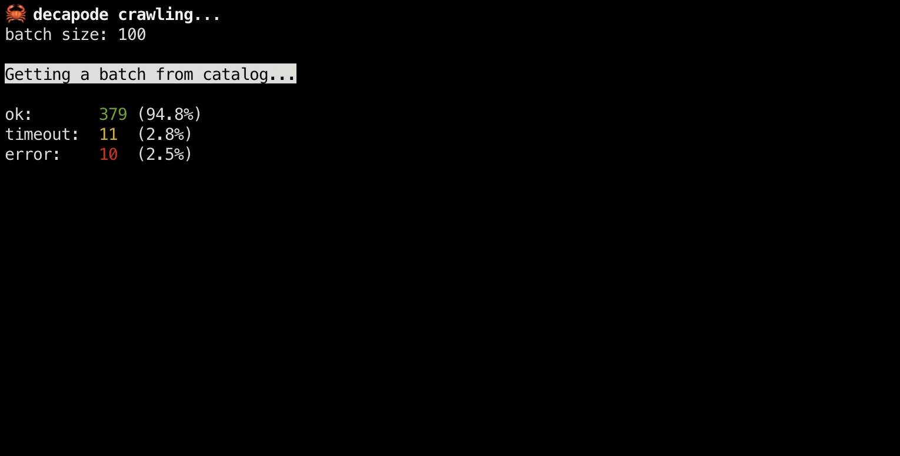

# decapode 🦀

`decapode` is an async metadata crawler for [data.gouv.fr](https://www.data.gouv.fr).

URLs are crawled via _aiohttp_, catalog and crawled metadata are stored in a _PostgreSQL_ database.



## CLI

### Create database structure

`decapode init-db`

### Load (UPSERT) latest catalog version from data.gouv.fr

`decapode load-catalog`

### Print summary

```
$ python cli.py summary
-------------  ------  ------
Left to check       0
Checked        111482  100.0%
Errors           4217  3.8%
Timeouts         1204  1.1%
Replied        106061  95.1%
-------------  ------  ------

  HTTP code    Count
-----------  -------
        200    88944
        404    10144
        500     2913
        502     2760
        429      700
        400      673
        501      655
        403      236
        405       80
        503       44
        202       39
        401       14
        530        1
        410        1
```

## Crawler

`decapode-crawl`

It will crawl (forever) the catalog according to config set in `config.py`.

`BATCH_SIZE` URLs are queued at each loop run.

The crawler will start with URLs never checked and then proceed with URLs crawled before `SINCE` interval. It will then wait until something changes (catalog or time).

There's a by-domain backoff mecanism. The crawler will wait when, for a given domain in a given batch, `BACKOFF_NB_REQ` is exceeded in a period of `BACKOFF_PERIOD` seconds. It will sleep and retry until the backoff is lifted.

If an URL matches one of the `EXCLUDED_PATTERNS`, it will never be checked.

A curses interface is available via:

`DECAPODE_CURSES_ENABLED=True decapode-crawl`

## API

### Run

```
pip install -r requirements.dev.txt
adev runserver decapode/app.py
```

### Get latest check

Works with `?url={url}` and `?resource_id={resource_id}`.

```
$ curl -s "http://localhost:8000/checks/latest/?url=http://opendata-sig.saintdenis.re/datasets/661e19974bcc48849bbff7c9637c5c28_1.csv" | json_pp
{
   "status" : 200,
   "catalog_id" : 64148,
   "deleted" : false,
   "error" : null,
   "created_at" : "2021-02-06T12:19:08.203055",
   "response_time" : 0.830198049545288,
   "url" : "http://opendata-sig.saintdenis.re/datasets/661e19974bcc48849bbff7c9637c5c28_1.csv",
   "domain" : "opendata-sig.saintdenis.re",
   "timeout" : false,
   "id" : 114750,
   "dataset_id" : "5c34944606e3e73d4a551889",
   "resource_id" : "b3678c59-5b35-43ad-9379-fce29e5b56fe",
   "headers" : {
      "content-disposition" : "attachment; filename=\"xn--Dlimitation_des_cantons-bcc.csv\"",
      "server" : "openresty",
      "x-amz-meta-cachetime" : "191",
      "last-modified" : "Wed, 29 Apr 2020 02:19:04 GMT",
      "content-encoding" : "gzip",
      "content-type" : "text/csv",
      "cache-control" : "must-revalidate",
      "etag" : "\"20415964703d9ccc4815d7126aa3a6d8\"",
      "content-length" : "207",
      "date" : "Sat, 06 Feb 2021 12:19:08 GMT",
      "x-amz-meta-contentlastmodified" : "2018-11-19T09:38:28.490Z",
      "connection" : "keep-alive",
      "vary" : "Accept-Encoding"
   }
}
```

### Get all checks for an URL or resource

Works with `?url={url}` and `?resource_id={resource_id}`.

```
$ curl -s "http://localhost:8000/checks/all/?url=http://www.drees.sante.gouv.fr/IMG/xls/er864.xls" | json_pp
[
   {
      "domain" : "www.drees.sante.gouv.fr",
      "dataset_id" : "53d6eadba3a72954d9dd62f5",
      "timeout" : false,
      "deleted" : false,
      "response_time" : null,
      "error" : "Cannot connect to host www.drees.sante.gouv.fr:443 ssl:True [SSLCertVerificationError: (1, \"[SSL: CERTIFICATE_VERIFY_FAILED] certificate verify failed: Hostname mismatch, certificate is not valid for 'www.drees.sante.gouv.fr'. (_ssl.c:1122)\")]",
      "catalog_id" : 232112,
      "url" : "http://www.drees.sante.gouv.fr/IMG/xls/er864.xls",
      "headers" : {},
      "id" : 165107,
      "created_at" : "2021-02-06T14:32:47.675854",
      "resource_id" : "93dfd449-9d26-4bb0-a6a9-ee49b1b8a4d7",
      "status" : null
   },
   {
      "timeout" : false,
      "deleted" : false,
      "response_time" : null,
      "error" : "Cannot connect to host www.drees.sante.gouv.fr:443 ssl:True [SSLCertVerificationError: (1, \"[SSL: CERTIFICATE_VERIFY_FAILED] certificate verify failed: Hostname mismatch, certificate is not valid for 'www.drees.sante.gouv.fr'. (_ssl.c:1122)\")]",
      "domain" : "www.drees.sante.gouv.fr",
      "dataset_id" : "53d6eadba3a72954d9dd62f5",
      "created_at" : "2020-12-24T17:06:58.158125",
      "resource_id" : "93dfd449-9d26-4bb0-a6a9-ee49b1b8a4d7",
      "status" : null,
      "catalog_id" : 232112,
      "url" : "http://www.drees.sante.gouv.fr/IMG/xls/er864.xls",
      "headers" : {},
      "id" : 65092
   }
]
```

## TODO

- [x] non curse interface :sad:
- [ ] denormalize interesting headers (length, mimetype, last-modified...)
- [ ] handle GET requests for some domains
- [ ] some sort of dashboard (dash?), or just plug postgrest and handle that elsewhere
